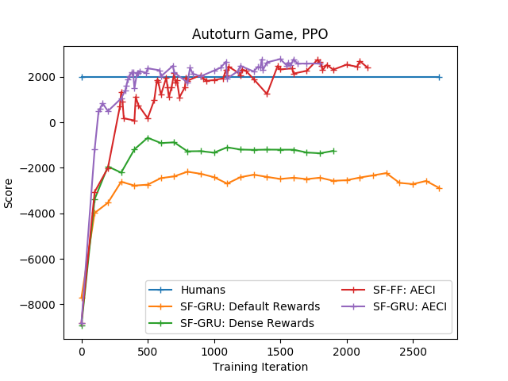
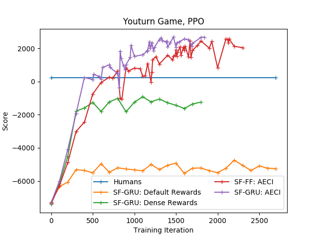

# Space Fortress

**Space Fortress is a benchmark for studying context and temporal sensitivity of deep reinforcement learning algorithms.**

This repository contains:
1. An OpenAI Gym compatible RL environment for Space Fortress, courtesy of Shawn Betts and Ryan Hope [bitbucket url](https://bitbucket.org/andersonlab/c-spacefortress)
2. Baseline code for deep reinforcement learning (PPO, A2C, Rainbow) on the Space Fortress environments

This repo accompanies our arXiv paper [1805.06824](https://arxiv.org/abs/1805.06824). If you used this code or would like to cite our paper, please cite using the following BibTeX:

    @article{DBLP:journals/corr/abs-1805-06824,
      author    = {Akshat Agarwal and Ryan Hope and Katia Sycara},
      title     = {Learning Time-Sensitive Strategies in Space Fortress},
      journal   = {CoRR},
      volume    = {abs/1805.06824},
      year      = {2018},
      url       = {http://arxiv.org/abs/1805.06824}
    }

## Installation

#### Needs Python 3.5 and [OpenAI Gym](https://github.com/openai/gym)

### Build Space Fortress Gym Environment
1. `cd` into the `python/spacefortress` folder, and run `pip install -e .`
2. Then `cd` into the `python/spacefortress-gym` folder and run `pip install -e .`
Done! You can now add `import spacefortress.gym` to your script and start using the Space Fortress environments.

### Requirements for the baseline RL code
Install PyTorch (v0.4 or higher) from [their website](https://pytorch.org), and then run:
```bash
pip install numpy tensorboardX gym_vecenv opencv-python atari-py plotly
```
OR you can install dependencies individually:
* numpy
* [PyTorch](https://pytorch.org) (v0.4 or higher)
* [tensorboardX](https://github.com/lanpa/tensorboardX)
* [gym_vecenv](https://github.com/agakshat/gym_vecenv)
* opencv-python `pip install opencv-python`
* [atari-py](https://github.com/openai/atari-py)
* [plotly](https://github.com/plotly/plotly.py)


Credits to [ikostrikov](https://github.com/ikostrikov/pytorch-a2c-ppo-acktr) and [Kaixhin](https://github.com/Kaixhin/Rainbow) for their excellent implementations of PPO, A2C and Rainbow.

## Training
### PPO/A2C
In the `rl` folder, run 
```bash
python train.py --env-name youturn
```
By default, uses recurrent (SF-GRU) architecture and PPO algorithm. To use A2C, add `--a2c` in the run command, and to use the feedforward SF-FF architecture, add `--feedforward` in the run command. Change the `--env-name` flag to `autoturn` to use that version of Space Fortress. For details on Autoturn and Youturn, please refer to the paper (linked above).

Flags for algorithmic hyperparameters can be found in `rl/arguments.py` and accordingly specified in the run command.

### Rainbow
In the `rl/rainbow` folder, run
```bash
python main.py --game youturn
```
Flags for algorithmic hyperparameters can be found in `rl/rainbow/main.py` and accordingly specified in the run command.

## Evaluation
### PPO/A2C
In the `rl` folder, run 
```bash
python evaluate.py --env-name youturn --load-dir <specify trained model file>
```
To evaluate a model with feedforward architecture, add the `--feedforward` flag to the run command. Similarly, add `--render` to see the agent playing the game.

### Rainbow
In the `rl/rainbow` folder, run
```bash
python main.py --game youturn --evaluate --model <specify trained model file>
```

## Learning Curves
### PPO





